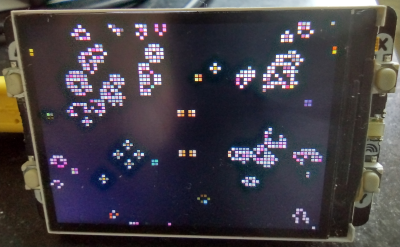

# pico-conway

Cellular automata on a pico...



Cells are colour-coded according to their age. Button A resets, B clears the screen, X adds a randomly-placed glider (this happens randomly without pressing anything). Y toggles screen brightness.

Pico2 allows for a 160x120 cell domain, memory restrictions mean the original Pico can only support 106x80.

## build

### hardware

Uses the Rasbperry Pi [Pico](https://www.raspberrypi.com/products/raspberry-pi-pico/) or [Pico2](https://www.raspberrypi.com/products/raspberry-pi-pico-2/) with the [Pimoroni pico-display-2](https://shop.pimoroni.com/products/pico-display-pack-2-0?variant=39374122582099)

### software

Requires pico-sdk and the pimoroni-pico](https://github.com/pimoroni/pimoroni-pico) libraries.

1. fork or clone this repo.

1. download and extract a release of the [pico C/C++ SDK](https://github.com/raspberrypi/pico-sdk)

1. download and extract a release of [pimoroni-pico](https://github.com/pimoroni/pimoroni-pico). This is needed for the graphics library and display driver.

1. download a cross-compiler e.g. g++-arm-none-eabi if necessary. Prebuilt riscv toolchains is available [here](https://github.com/raspberrypi/pico-sdk-tools/releases/tag/v2.0.0-1)

1. edit CMakeLists.txt so that PICO_SDK_PATH and PIMORONI_PATH point to the correct locations

1. build the image for the intended platform, optionally supplying the toolchain path (if not in `$PATH`), e.g.

    ```sh
    mkdir -p build
    cd build
    cmake -DPICO_PLATFORM=rp2350-riscv -DPICO_TOOLCHAIN_PATH=/opt/riscv-gcc-14 ..
    make -j
    ```

    Valid values for `PICO_PLATORM` are:
    - `rp2040` (Cortex M0+)
    - `rp2350` or `rp2350-arm-s` (Cortex M33+)
    - `rp2350-riscv` (Hazard 3)

1. copy image to device (connected with `BOOTSEL` pressed), e.g.

    ```sh
    cp pico-conway.uf2 /media/<username>/RPI-RP2
    ```

## test

The algorithm itself can be tested/debugged on the host machine using the test harness, e.g.:

```sh
g++ -g -O0 -Wall -Werror --std=c++20 src/test_conway.cpp src/conway.cpp -o test
```
